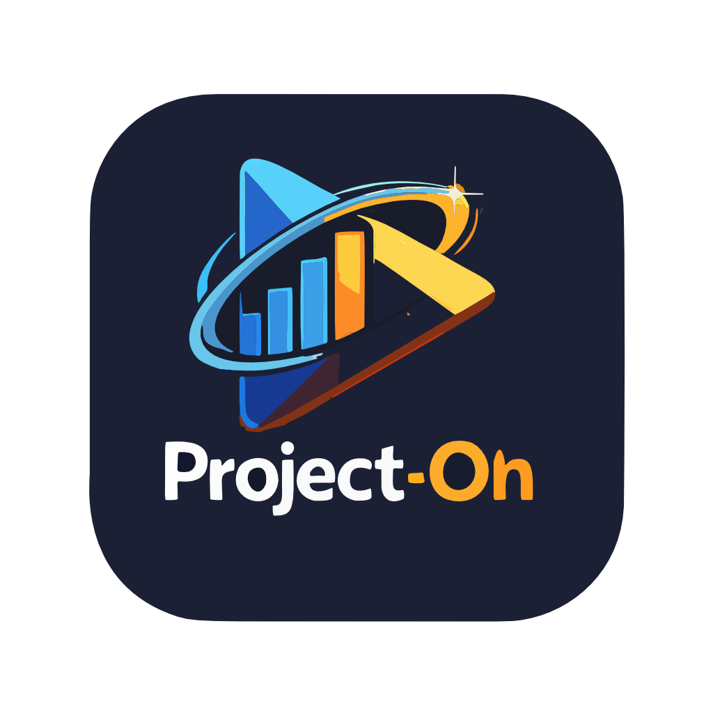
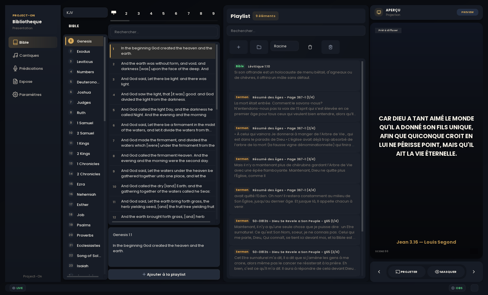
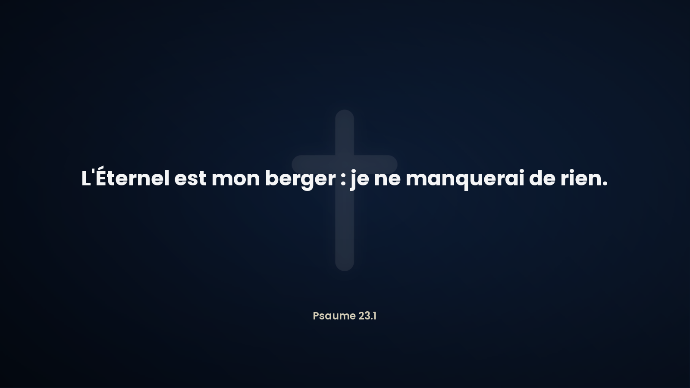

<div align="center">



# Project-On

**Logiciel de projection pour églises — Bible, Cantiques, Prédications, Exposés.**
Sortie OBS (lower-third) · Projection plein écran cinématique · 100 % hors-ligne.

[**🌐 Site web**](https://elienyembo.github.io/project-on/) · [**⬇️ Télécharger**](https://github.com/elienyembo/project-on/releases/latest) · [Captures d'écran](#aperçu)

</div>

---

## ✨ Fonctionnalités

- **Bible** — navigation livre par livre, recherche et projection du verset avec sa référence.
- **Cantiques** — bibliothèque organisée par strophes.
- **Prédications & Exposés** — import et présentation structurée.
- **Sortie OBS · Lower Third** — bandeau « broadcast » personnalisable (position, police, couleurs, dégradé, flou, ombres, contour, préréglages) avec aperçu en direct.
- **Projection cinématique** — transitions Fondu, Glissement, Zoom, Flou et Reveal + zoom lent (Ken Burns) sur les images de fond.
- **Arrière-plans chrétiens** — fonds sobres et lisibles (croix, aigle, lion, agneau).

## ⬇️ Installation (Windows)

1. Téléchargez **`ProjectOn_1.3.0_Setup.exe`** depuis la [dernière version](https://github.com/elienyembo/project-on/releases/latest).
2. Lancez l'installeur (français). Si Windows affiche **SmartScreen**, cliquez sur « Informations complémentaires » → « Exécuter quand même ».
3. Ouvrez **Project-On**. Tout fonctionne hors-ligne.

> Windows 10 / 11 (64 bits) · ~500 Mo d'espace · un second écran ou projecteur recommandé.

## 🖼️ Aperçu

| Interface | Projection |
|---|---|
|  |  |

## 🛠️ Développement

```bash
py -3 -m pip install -r requirements.txt
py -3 main.py
```

> La base de données fournie (`data/project_on.db`) et les binaires NDI sont distribués via l'installeur — ils ne sont pas versionnés ici (taille). Tests : `py -3 -m pytest tests/ verification/`.

Construire l'installeur (PyInstaller + Inno Setup) :

```bat
build_installer.bat
```

## 📜 Licence & crédits

- Code : voir [LICENSE.txt](LICENSE.txt).
- Silhouettes aigle / lion / agneau dérivées de [game-icons.net](https://game-icons.net/) (Lorc, Delapouite) — **CC BY 3.0**.

<div align="center">

© 2026 Onzième Heure Tab · Publié par Elie Nyembo

</div>
